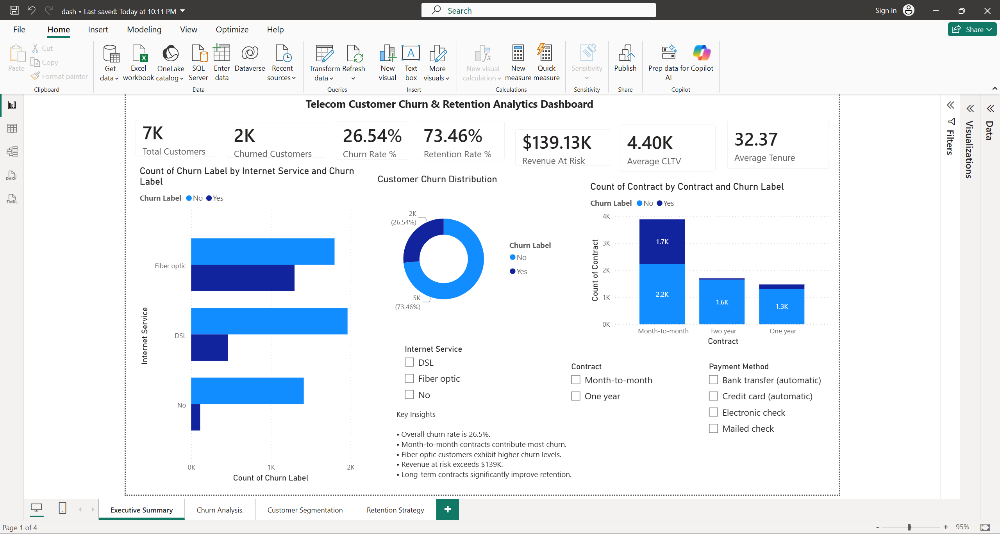
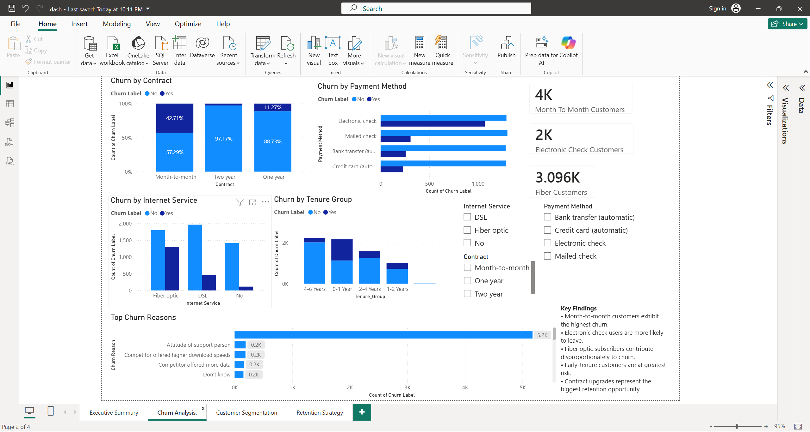
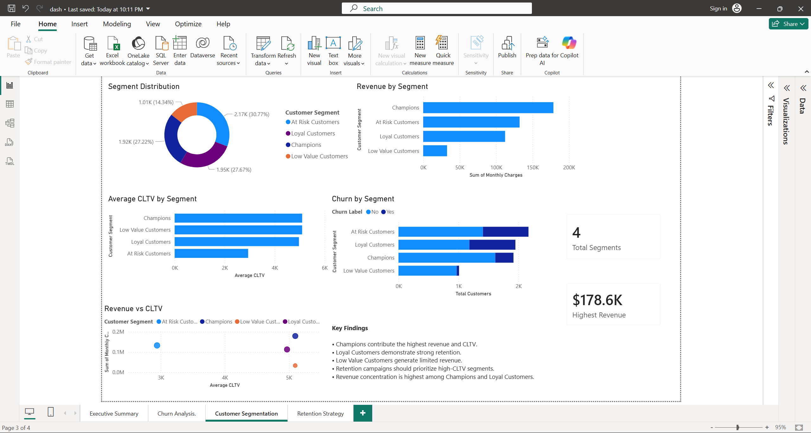
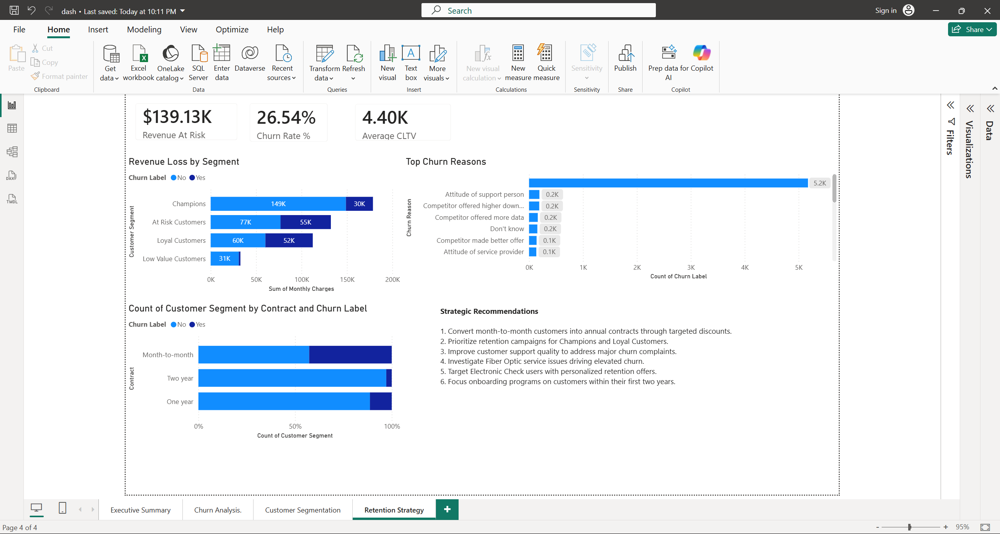

# 📊 Telecom Customer Churn Analytics & Retention Dashboard

## 🚀 Project Overview

Customer churn is a major challenge for telecom companies, directly impacting revenue and customer lifetime value. This project analyzes customer churn behavior using Python, SQL, and Power BI to identify churn drivers, segment customers, quantify revenue at risk, and provide actionable retention strategies.

The project follows a complete analytics workflow, from data cleaning and exploratory analysis to customer segmentation and interactive business dashboards.

---

## 🎯 Business Problem

Telecom companies need to understand:

* Why customers leave the service.
* Which customer groups are most likely to churn.
* How churn impacts revenue.
* Which customers should be prioritized for retention efforts.

This project transforms raw customer data into actionable business insights that support data-driven decision-making.

---

## 📂 Project Structure

```text
Telecom-Customer-Churn-Analytics/
│
├── data/
│   ├── raw/
│   └── processed/
│
├── notebooks/
│   ├── 01_data_understanding.ipynb
│   ├── 02_data_cleaning.ipynb
│   ├── 03_eda_business_insights.ipynb
│   ├── 04_customer_segmentation.ipynb
│   └── 05_sql_analytics.ipynb
│
├── dashboard/
│   └── Telecom_Churn_Dashboard.pbix
│
├── sql/
│   └── churn_analysis_queries.sql
│
├── reports/
│   └── project_report.pdf
│
└── README.md
```

---

## 🛠️ Tech Stack

### Programming & Analytics

* Python
* Pandas
* NumPy
* SQL

### Visualization

* Matplotlib
* Seaborn
* Power BI

### Machine Learning

* Scikit-Learn
* K-Means Clustering

### Version Control

* Git
* GitHub

---

## 📈 Dashboard Pages

### 1️⃣ Executive Summary

Key KPIs:

* Total Customers
* Churned Customers
* Churn Rate
* Revenue At Risk
* Average CLTV
* Average Tenure

---

### 2️⃣ Churn Analysis

Analyzes churn patterns across:

* Contract Type
* Payment Method
* Internet Service
* Customer Tenure
* Churn Reasons

---

### 3️⃣ Customer Segmentation

Customers are segmented into:

* 🏆 Champions
* 🤝 Loyal Customers
* ⚠️ At-Risk Customers
* 📉 Low-Value Customers

Visualizations include:

* Segment Distribution
* Revenue by Segment
* CLTV by Segment
* Churn by Segment

---

### 4️⃣ Retention Strategy

Business-focused recommendations based on:

* Revenue Loss by Segment
* Churn Drivers
* Contract Risk Analysis
* Customer Retention Opportunities

---

## 📊 Key Findings

### Customer Churn

* Overall churn rate: **26.54%**
* Approximately **1 in 4 customers** discontinued service.

### Contract Type

* Month-to-month customers exhibited the highest churn rates.
* Long-term contracts significantly improved retention.

### Payment Method

* Customers using **Electronic Check** showed elevated churn levels.

### Internet Service

* Fiber Optic subscribers demonstrated the highest churn behavior.

### Customer Tenure

* Customers within the first two years were more likely to churn.

### Revenue Impact

* Revenue at risk exceeded **$139K** from churned customers.

---

## 👥 Customer Segmentation Insights

### Champions

* Highest revenue contribution
* Highest CLTV
* Strong retention behavior

### Loyal Customers

* Consistent revenue generation
* Lower churn probability

### At-Risk Customers

* High churn likelihood
* Immediate retention opportunity

### Low-Value Customers

* Low revenue contribution
* Suitable for low-cost retention campaigns

---

## 💡 Business Recommendations

* Convert month-to-month customers into annual contracts through targeted incentives.
* Improve support quality to reduce customer dissatisfaction.
* Investigate Fiber Optic service issues contributing to churn.
* Develop onboarding programs for new customers.
* Prioritize retention campaigns for Champions and Loyal Customers.
* Target Electronic Check users with personalized offers.

---

## 📸 Dashboard Screenshots

### Executive Summary



### Churn Analysis



### Customer Segmentation



### Retention Strategy



---

## 📌 Project Outcomes

✔ Identified major churn drivers

✔ Quantified revenue at risk

✔ Developed customer segmentation framework

✔ Built an interactive Power BI dashboard

✔ Generated actionable business recommendations

✔ Enabled data-driven customer retention strategies

---

## ⭐ Resume Highlights

* Analyzed churn behavior across **7,000+ telecom customers** using Python and SQL.
* Performed customer segmentation using **K-Means Clustering** to identify Champions, Loyal, At-Risk, and Low-Value customer groups.
* Built a **4-page Power BI dashboard** with 20+ interactive visualizations tracking churn KPIs, revenue at risk, CLTV, and retention opportunities.

---

## 👤 Author

**Himit Narayan**

* LinkedIn: https://www.linkedin.com/in/himit-narayan/
* GitHub: https://github.com/himitnarayan
# telecom-customer-churn-analytics
# telecom-customer-churn-analytics
